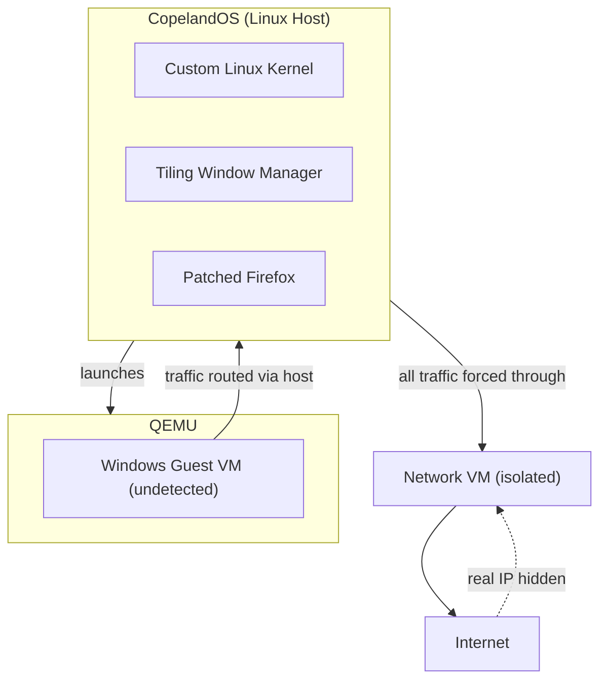

# CopelandOS

```
⠀⠀⠀⠀⠀⠀⠀⠄⣀⠢⢀⣤⣿⣿⣿⣿⣿⣿⣿⣿⣿⣿⣿⣿⣿⣿⣿⣿⣿⣿⣿⣿⣿⣿⣿⣿⣿⣿⣿⣿⣿⣿⣿⣿⣿⣿⣿⣷⣄⠀⡔⢀⠂⡜⢭⢻⣍⢯⡻⣝⣿⣿⡿⣟⠂
⠀⠀⠀⠀⠀⠀⠀⠄⠀⣦⣿⣿⣿⣿⣿⣿⣿⣿⣿⣿⣿⣿⣿⣿⣿⣿⣿⣿⣿⣿⣿⣿⣿⣿⣿⣿⣿⣿⣿⣿⣿⣿⣿⣿⣿⣿⣿⣿⣿⣷⡔⡀⢂⠜⣪⢗⡾⣶⡽⣾⣟⣯⠛⠀⠀
⠀⠀⠀⠀⠀⠄⠀⠠⣶⣿⣿⣿⣿⣿⣿⣿⣿⣿⣿⣿⣿⣿⣿⣿⣿⣿⣿⣿⣿⣿⣿⣿⣿⣿⣿⣿⣿⣿⣿⣿⣿⣿⣿⣿⣿⣿⣿⣿⣿⣿⣿⣔⠨⡸⡝⣯⣳⢏⣿⠳⠉⠀⢠⣬⡶
⠠⣓⢤⣂⣄⣀⢀⣾⣿⣿⣿⣿⣿⣿⣿⣿⣿⣿⣿⣿⣿⣿⣿⣿⣿⣿⣿⣿⣿⣿⣿⣿⣿⣿⣿⣿⣿⣿⣿⣿⣿⣿⣿⣿⣿⣿⣿⣿⣿⣿⣿⣿⡆⠁⣞⡱⣝⠎⠀⢀⠠⣥⠳⡞⡹
⠀⡄⢉⠲⢿⣼⣿⣿⣿⣿⣿⣿⣿⣿⣿⣿⣿⣿⣿⣿⣿⣿⣿⣿⣿⣿⣿⣿⣿⣿⣿⣿⣿⣿⣿⣿⣿⣿⣿⣿⣿⣿⣿⣿⣿⣿⣿⣿⣿⣿⣿⣿⣿⡔⣧⡽⠋⠀⣰⣶⣻⣶⣿⢾⣷
⢤⡈⠉⠲⢤⣿⣿⣿⣿⣿⣿⣿⣿⣿⣿⣿⣿⣿⣿⣿⣿⣿⣿⣿⣿⣿⣿⣿⣿⣿⣿⣿⣿⣿⣿⣿⣿⣿⣿⣿⣿⣿⣿⣿⣿⣿⣿⣿⣿⣿⣿⣿⣿⣿⠁⢀⡴⢏⡳⢮⡿⣽⣞⠻⡜
⠒⣭⠳⢶⣼⣿⣿⣿⣿⣿⣿⣿⣿⣿⣿⣿⣿⣿⣿⣿⣿⣿⣿⣿⣿⣿⣿⣿⣿⣿⣿⣿⣿⣿⣿⣿⣿⣿⣿⣿⣿⣿⣿⣿⣿⣿⣿⣿⣿⣿⣿⣿⣿⣿⣿⢿⡙⠮⣜⣯⡽⣳⢌⡓⠈
⡸⣰⢋⣷⣿⣿⣿⣿⣿⣿⣿⣿⣿⣿⣿⣿⣿⣿⣿⣿⣿⣿⣿⣿⣿⣿⣿⣿⣿⣿⣿⣿⣿⣿⣿⣿⣿⣿⣿⣿⣿⣿⣿⣿⣿⣿⣿⣿⣿⣿⣿⣿⣿⣿⣿⣷⣻⢿⣻⣿⡽⣗⠋⠄⠀
⣣⢇⢟⣸⣿⣿⣿⣿⣿⣿⣿⣿⣿⣿⣿⣿⣿⣿⣿⣿⣿⣿⣿⣿⣿⣿⣿⣿⣿⣿⣿⣿⣿⣿⣿⣿⣿⣿⣿⣿⣿⣿⣿⣿⣿⣿⣿⣿⣿⣿⣿⣿⣿⣿⣿⣧⢟⡿⢣⣟⡻⠘⠀⠀⠀
ⱱ⡊⠤⣸⣿⣿⣿⣿⣿⣿⣿⣿⣿⣿⣿⣿⣿⣿⣿⣿⣿⣿⣿⣿⣿⠿⣿⣿⣿⣿⣿⣿⣿⣿⣿⣿⣿⣿⣿⣿⣿⣿⣿⣿⣿⣿⣿⣿⣿⣿⣿⣿⣿⣿⣿⣿⠨⠗⠋⣁⣤⠖⠊⢁⣀
⠀⠁⠂⢹⣿⣿⣿⣿⣿⣿⣿⣿⣿⣿⣿⣿⣿⣿⣿⡏⠀⠀⠀⠀⣿⡂⠹⣿⣿⣿⣿⣿⠙⣿⣿⣿⣿⣿⣿⣿⣿⡿⣿⣿⣿⣿⣿⣿⣿⣿⣿⣿⣿⣿⣿⣿⠄⠒⢋⣉⡤⣔⣮⣽⣾
⢢⠣⣌⢼⣿⣿⣿⣿⣿⣿⣿⣿⣿⣿⣿⣿⣿⣿⣿⠀⠀⠀⠀⢰⣿⡅⠀⣿⣿⣿⣿⣿⠀⠸⢿⣹⣿⣿⣿⣿⣿⡇⣿⣿⣿⣿⣿⣿⣿⣿⣿⣿⣿⣿⣿⣿⣶⣻⣿⣿⣿⣿⣿⣿⣿
⢃⡉⠠⢸⣿⣿⣿⣿⣿⣿⣿⣿⣿⣿⣿⣿⡟⣼⢹⠀⠀⠀⠀⣾⠿⡇⠀⣿⣿⣿⣿⡏⠀⠀⣞⣧⣻⠟⢿⣿⣿⢠⣿⣿⣿⣿⣿⣿⣿⣿⣿⣿⣿⣿⣿⡿⣧⠱⣌⣳⣽⣻⣿⣿⣻
⠀⢒⡕⣺⣿⣿⣿⣿⣿⣿⣿⣿⣿⣿⣿⣿⠁⡇⠈⣇⠀⠀⠀⠈⡆⢳⠀⠇⡟⠋⠉⠀⠀⠀⠃⢙⣠⣤⣤⣼⣯⣚⣟⢸⣿⣿⣿⣿⣿⣿⣿⣿⣿⣿⣿⠀⠌⠑⠌⢳⠛⡛⠏⠛⠉
⡘⢷⣌⣿⣿⣿⣿⣿⣿⣿⣿⣿⣿⡟⠉⢻⣀⣧⣤⣽⣦⣤⣄⠀⠰⡀⠃⠀⠀⠀⠀⠀⠀⡴⠟⠛⣉⣉⡉⠉⠈⠉⠉⠉⠋⢻⣿⣿⣿⣿⣿⣿⣿⣿⣿⠀⢈⠈⠈⠁⠛⠀⠀⠀⣒
⠉⢣⡛⣿⣿⣿⣿⣿⣿⣿⣿⣿⡧⠖⠛⠉⠉⠉⠀⠀⠐⠒⢢⡄⠀⠀⠀⠀⠀⠀⠀⠀⠀⠀⠀⡾⣠⣲⣾⣿⢿⣷⢶⡄⠀⠀⣽⣿⣿⣿⣿⡿⠟⣿⣿⣿⣿⣿⠛⢁⣤⡶⠿⠛⠋
⠀⠀⠌⢽⣿⣿⣿⣿⣿⣿⣿⣿⡷⠀⠀⠀⣠⣶⣶⣿⣟⣿⣶⡅⠀⠀⠀⠀⠀⠀⠀⠀⠀⠀⠀⠀⠃⢿⣿⣿⣿⣿⠀⣿⡀⠀⢻⣬⣙⡻⡿⣡⣾⣿⣿⡍⠈⣀⣤⣬⣤⣶⣲⣶⣿
⠀⢈⠐⡀⢻⣫⢿⣿⣿⣿⣿⠘⢧⠁⠀⣻⡏⠸⣿⣿⣿⣿⠏⠀⠀⠀⠀⠀⠀⠀⠀⠀⠀⠀⠀⠀⠑⢄⣉⣛⣋⣡⡴⠃⠀⠀⣿⣿⣿⠟⣠⡛⢿⣿⣿⣷⣲⣽⣿⣿⣷⣾⣷⣿⣿
⠀⠀⢀⠐⡀⢃⡈⣿⢿⣿⣿⣟⡆⠀⠀⠉⠿⣦⣈⣉⣉⠤⠚⠁⠀⠀⠀⠀⠀⠀⠀⠀⠀⠀⠀⠀⠀⠀⠀⠀⠀⠀⠀⠀⠀⠀⣿⡟⣡⣶⣿⣿⣾⣿⣿⣿⢿⡿⣿⣿⡿⠿⠛⣋⣡
⠠⠐⡀⢢⣶⣿⢧⠻⣯⣿⣯⡛⢿⡄⠀⠀⠀⠀⠀⠀⠀⠀⠀⠀⠀⠀⠀⠀⠀⠀⠀⠀⠀⠀⠀⠀⠀⠀⠀⠀⠀⠀⠀⠀⠀⠀⣿⣿⣿⣿⣿⣿⣿⣿⣿⠘⠐⠂⡁⠤⠔⢂⣉⣤⡴
⣀⠥⠌⣳⢯⣟⣮⣗⣾⣟⣿⣿⣦⣭⡀⠀⠀⠀⠀⠀⠀⠀⠀⠀⠀⠀⠀⠀⠀⠀⠀⠀⠀⠀⠀⠀⠀⠀⠀⠀⠀⠀⠀⠀⠀⠀⣿⣿⣿⣿⣿⣿⣿⣿⣿⠂⣈⠥⡔⡤⣍⠣⣝⢾⡹
⠀⠀⠀⠠⠈⠉⠈⠉⠉⠉⣨⣿⣿⣿⣯⠀⠀⠀⠀⠀⠀⠀⠀⠀⠀⠀⠀⠀⠀⠀⠀⠀⠀⠀⠀⠀⠀⠀⠀⠀⠀⠀⠀⠀⠀⢀⣿⣿⣿⣿⣿⣿⣿⣿⡟⠻⢞⣿⣝⣳⢎⢳⢻⡮⣕
⠀⠀⢀⠀⡀⠀⠀⣀⣴⣾⣿⣿⣿⣿⣿⣧⡀⠀⠀⠀⠀⠀⠀⠀⠀⠀⠀⠀⠀⠀⠀⠀⠀⠀⠀⠀⠀⠀⠀⠀⠀⠀⠀⠀⣰⣿⣿⣿⣿⣿⣿⣿⣿⣿⡗⢠⠘⡼⣽⣛⡞⠦⣧⢻⣽
⠀⢈⠀⡀⡀⢤⠞⡉⢭⣹⣿⣿⣿⣿⣿⣿⣿⣄⠀⠀⠀⠀⠀⠀⠀⠀⠀⠀⠀⠈⠈⠀⠀⠀⠀⠀⠀⠀⠀⠀⠀⠀⢀⣴⣿⣿⣿⣿⣿⣿⣿⣿⣟⣿⣍⣣⢾⣵⣯⣷⣽⣦⣑⣯⢿
⠀⠂⣴⣾⡟⣧⠊⡔⢢⠛⣿⣿⣿⣿⣿⣿⣿⣿⣷⣀⠀⠀⠀⠀⠀⠀⠀⠀⠀⠐⠒⠂⠀⠀⠀⠀⠀⠀⠀⠀⠀⢠⣾⣿⣿⣿⣿⣿⣿⣿⣿⡟⠉⣯⢹⣽⢻⣿⣿⣿⣿⣿⣿⣿⣿
⣶⣟⠳⣏⡿⣎⠳⣈⡜⣺⣿⠿⢿⣝⡿⣫⢟⣽⣿⣿⠻⣦⣄⠀⠀⠀⠀⠀⠀⠀⠀⠀⠀⠀⠀⠀⠀⠀⠀⢀⠔⠛⣿⠿⣟⢩⢾⣿⣿⣿⣿⣇⠾⣜⡧⣯⣟⣿⣿⣿⣿⣿⣿⣿⣿
⠋⢀⢱⣫⣟⢾⡹⢴⡸⣵⡏⣂⢾⡿⣽⣹⣟⣾⣿⡟⢠⡇⠀⣹⠂⠄⣀⠀⠀⠀⠀⠀⠀⠀⠀⠀⠀⠀⠀⠀⠀⠀⣷⣣⢟⡿⣾⣿⣿⣿⣿⢌⠫⢝⡻⣵⢻⡟⣿⢿⣿⢿⡿⣿⠿
⠀⢢⠞⣴⢯⢯⣝⣦⢳⡝⡶⣭⣿⣽⣳⣟⡾⣽⡟⢀⡟⠀⢀⡿⠀⠀⠀⠁⠠⠤⠀⠀⠀⠤⠐⠀⠀⠀⠀⠀⠀⠀⢸⡗⠈⠭⣿⣿⣿⣿⡿⢌⠣⡀⡐⢈⠃⠚⠦⣉⠂⠣⠜⡄⢋
⣜⣷⢻⡜⣯⣾⡞⣥⣓⢾⡽⢎⡷⢯⡷⣯⢟⣽⠃⣸⠁⠀⡼⠃⠀⠀⠀⠀⠀⠀⠀⠀⠀⠀⠀⠀⠀⠀⠀⠀⠀⠀⠀⢻⡄⢹⣿⣿⣿⣿⢃⡮⡑⢰⢠⣂⡜⣦⡴⣱⣎⣴⣩⡜⣦
⣿⣯⢷⡻⣏⣷⣟⠶⣙⠮⡙⢪⠜⣯⢽⣯⣿⠃⠄⢃⣠⠞⠁⠀⠀⠀⠀⠀⠀⠀⠀⠀⠀⠀⠀⠀⠀⠀⠀⠀⠀⠀⠀⠀⠹⣾⣿⣿⣿⡇⠢⢡⡙⢦⡓⡼⣽⣾⣿⣿⣿⣿⣷⣿⣿
⣿⡹⢇⡳⡹⣞⠘⡈⢅⠢⢁⠂⡘⠤⣋⣶⣡⠴⠚⠉⠀⠀⠀⠀⠀⠀⠀⠀⠀⠀⠀⠀⠀⠀⠀⠀⠀⠀⠀⠀⠀⠀⠀⠀⠀⣿⣿⣿⣿⠰⡁⢆⠘⣡⠻⣽⣳⣿⣿⣿⣿⢿⣿⣿⣿
⢣⠝⡢⢍⠱⢈⣂⣌⡤⠦⠶⠶⠞⠛⠋⠁⠀⠀⠀⠀⠀⠀⠀⠀⠀⠀⠀⠀⠀⠀⠀⠀⠀⠀⠀⠀⠀⠀⠀⠀⠀⠀⠀⠀⢰⣿⣿⣿⠛⠷⣭⣂⠌⢠⠓⡴⣻⣿⣿⣿⣿⣿⣿⣯⣿
⣇⢾⡱⠞⠈⠉⠀⠀⠀⠀⠀⠀⠀⠀⠀⠀⠀⠀⠀⠀⠀⠀⠀⠀⠀⠀⠀⠀⠀⠀⠀⠀⠀⠀⠀⠀⠀⠀⠀⠀⠀⠀⠀⠀⣸⣿⣿⡇⠀⠀⠀⠉⠛⠳⠿⣶⣽⣿⣿⣿⣿⣿⣿⣿⣿
```

A privacy-first operating system purpose-built for reverse engineering.

Inspired by Apple's unreleased **Copland OS** and the anime *Serial Experiments Lain*.

## How It Works



CopelandOS is a Linux-based host OS with its own kernel and a tiling window manager. Its job is to boot and manage an isolated Windows environment.

On startup, the system automatically launches **QEMU** and boots a **hardened Windows guest VM**. This Windows VM is configured to be undetectable as a virtual machine - it passes through hardware identifiers, avoids QEMU/KVM fingerprints, and neutralizes timing-based VM detection. This prevents malware, DRM, and anti-analysis software from realizing they are running inside a VM.

Two custom Windows ISOs are included:

- **Windows 10** - preloaded with a curated reverse engineering toolkit from the [52pojie.cn](https://www.52pojie.cn) community
- **Windows 11** - same toolkit, on the newer kernel

All internet traffic - from both the Linux host and any guest VMs - is forced through an isolated network VM, similar to how **Qubes OS** and **Tails** handle networking. Even if the Linux host itself is fully compromised through a zero-day exploit, the attacker cannot discover your real IP address or physical location.

CopelandOS itself ships with a **patched Firefox** similiar to Camoufox, browser hardened against fingerprinting. Standard browser fingerprinting scripts such as CreepJS and FingerprintJS are defeated by patching Firefox internals - spoofing canvas, WebGL, font, and audio context fingerprints at the browser level.

## Goals

- Undetected VM
- Privacy-first
- Network isolation
- Reverse engineering toolkit
- Tiling window manager
- Custom browser (anti-fingerprinting)

## Building

*Build instructions coming soon.*

## License

*License to be determined.*
